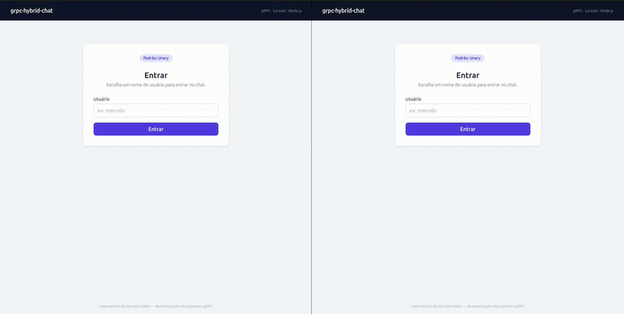

# grpc-hybrid-chat

> Chat em tempo real que demonstra os **quatro padrões de comunicação gRPC** em uma
> arquitetura híbrida realista: um microsserviço **Node.js** falando gRPC com uma
> borda pública em **Laravel/PHP**, que entrega tempo real ao browser via **SSE**.


---

## 📹 Demonstração

O projeto em ação, mostrando o padrão gRPC de duas formas complementares.

### 💬 Chat em tempo real (browser)

Dois usuários conversando ao mesmo tempo — as mensagens chegam **sozinhas** via SSE
(Server Streaming → browser), sem recarregar a página.



### ⌨️ Teste pelo terminal (Bidirecional puro)

Dois clientes Node em paralelo trocando mensagens com o stream **sempre aberto** —
o padrão Bidirecional de verdade, que o PHP stateless não consegue manter.


> Comando que aparece na demo: `docker compose exec node-server npm run demo`

---

## 🧠 O que este projeto demonstra

A maioria dos exemplos de gRPC mostra um único cliente chamando um único servidor.
Este laboratório vai além: reproduz o **padrão híbrido de mercado**, onde gRPC é o
protocolo *interno* entre serviços (rápido, tipado, sobre HTTP/2) enquanto o browser
continua falando HTTP/SSE com a borda pública.

```
        ┌─────────────────────────────────────────┐
        │              BROWSER                      │
        │      Blade  +  Tailwind  +  Alpine.js     │
        └───────────────┬───────────────────────────┘
                        │  HTTP (forms)  +  SSE (text/event-stream)
                        ▼
        ┌─────────────────────────────────────────┐
        │   NGINX  (proxy reverso) — porta 8080     │
        └───────────────┬───────────────────────────┘
                        │  FastCGI
                        ▼
        ┌─────────────────────────────────────────┐
        │   LARAVEL + PHP-FPM  (borda pública)      │
        │     AuthController     → Unary            │
        │     ChatController     → Bidirecional     │
        │     HistoryController  → Server Streaming │
        │     StreamController   → SSE              │
        │     GrpcChatService    (encapsula o gRPC) │
        └───────────────┬───────────────────────────┘
                        │  gRPC  (HTTP/2 + Protobuf)
                        ▼
        ┌─────────────────────────────────────────┐
        │   NODE.JS  (microsserviço) — porta 50051  │
        │     UserService.Login   (Unary)           │
        │     ChatService.GetHistory (Server Stream)│
        │     ChatService.Chat    (Bidirecional)    │
        │     estado em memória: Map / Array / Set  │
        └─────────────────────────────────────────┘
```

### Os padrões gRPC e onde aparecem

| Padrão gRPC | Método (`chat.proto`) | Como aparece no projeto |
|---|---|---|
| **Unary** | `UserService.Login` | Formulário de login: 1 requisição → 1 resposta |
| **Server Streaming** | `ChatService.GetHistory` | Servidor emite N mensagens do histórico em sequência |
| **Bidirecional Streaming** | `ChatService.Chat` | Dois clientes paralelos trocando mensagens ao vivo (`test-client.js`) |
| **SSE (browser)** | ponte sobre o Server Streaming | Mensagens chegando na tela em tempo real, sem polling |

---

## 📁 Estrutura do projeto

```
grpc-hybrid-chat/
├── proto/
│   └── chat.proto              # Contrato compartilhado (contract-first)
├── node-server/
│   ├── server.js               # Servidor gRPC (3 handlers)
│   ├── test-client.js          # Demo do Bidirecional (2 clientes paralelos)
│   ├── package.json
│   └── Dockerfile
├── laravel-client/
│   ├── app/Http/Controllers/   # Auth / Chat / History / Stream
│   ├── app/Http/Middleware/    # VerificarSessao
│   ├── app/Services/           # GrpcChatService (encapsula o gRPC)
│   ├── Generated/Chat/         # Stubs PHP gerados pelo protoc no build
│   ├── resources/views/        # Blade + Tailwind + Alpine.js
│   ├── routes/web.php
│   └── Dockerfile              # PHP-FPM + grpc (PECL) + protoc
├── nginx/
│   └── default.conf            # Proxy reverso + SSE sem buffer
├── docker-compose.yml          # node-server · laravel-fpm · nginx
├── docs/
│   └── GRAVACAO.md             # Como gravar os GIFs de cada padrão
└── README.md
```

---

## 🚀 Como rodar

### Pré-requisitos

- **Docker** e **Docker Compose** (caminho recomendado — não precisa de PHP/Node no host)
- (Opcional, para os testes via terminal) **Node.js 20+** e **grpcurl**

### Com Docker (recomendado)

```bash
# 1. Clone e entre na pasta
git clone https://github.com/MarceloPanho/grpc-hybrid-chat.git
cd grpc-hybrid-chat

# 2. Configure o ambiente
cp .env.example laravel-client/.env

# 3. Suba a stack inteira (node-server + laravel-fpm + nginx)
docker compose up --build
```

Acesse **http://localhost:8080** e faça login com **qualquer nome de usuário**
(não há senha — é um laboratório).

> O `docker compose` espera o **health check** do servidor Node passar antes de
> subir o Laravel, e o entrypoint do Laravel regenera os stubs PHP (`Generated/`)
> via `protoc` a cada start.

### Sem Docker (servidor Node isolado)

O servidor gRPC roda sozinho — útil para os testes via terminal:

```bash
cd node-server
npm install
npm start          # servidor gRPC em :50051
npm run demo       # em outro terminal: demo bidirecional com 2 clientes
```

> O lado Laravel depende de `ext-grpc` + `protoc` + `grpc_php_plugin`, que já vêm
> prontos na imagem Docker. Por isso o caminho fora do Docker cobre apenas o
> servidor Node.

---

## 🧪 Testando cada padrão via terminal

### 1. Demo bidirecional (Node ↔ Node)

```bash
cd node-server
npm run demo
```

Dois clientes (`Viviane` e `Marcelo`) conectam ao stream bidirecional ao mesmo
tempo e trocam mensagens com logs coloridos — o stream fica aberto dos dois lados,
algo que o PHP stateless não consegue manter (ver *Decisões técnicas*).

### 2. Chamadas gRPC diretas com `grpcurl`

O servidor expõe a porta `50051` no host justamente para isso:

```bash
# Listar serviços (requer reflection ou aponte o .proto):
grpcurl -plaintext -proto proto/chat.proto localhost:50051 list

# Unary — Login
grpcurl -plaintext -proto proto/chat.proto \
  -d '{"username":"marcelo"}' \
  localhost:50051 chat.UserService/Login

# Server Streaming — histórico (várias respostas em sequência)
grpcurl -plaintext -proto proto/chat.proto \
  -d '{}' \
  localhost:50051 chat.ChatService/GetHistory
```

### 3. Fluxo HTTP do Laravel com `curl`

```bash
# Login (Unary por baixo) — guarda o cookie de sessão
curl -c jar.txt -L -d "username=marcelo" http://localhost:8080/login

# Histórico (Server Streaming → JSON)
curl -b jar.txt http://localhost:8080/historico

# Stream SSE de longa duração (Ctrl+C para sair)
curl -b jar.txt -N http://localhost:8080/stream
```

---

## 🔌 O contrato gRPC

```protobuf
service UserService {
  rpc Login (LoginRequest) returns (LoginResponse);              // Unary
}

service ChatService {
  rpc GetHistory (Empty) returns (stream ChatMessage);           // Server Streaming
  rpc Chat (stream ChatMessage) returns (stream ChatMessage);    // Bidirecional
}
```

Contrato definido **antes** de qualquer código (*contract-first*): o Node.js carrega
o `.proto` em runtime (sem compilar), e o PHP gera stubs tipados a partir do mesmo
arquivo no build do Docker. Uma única fonte de verdade para os dois lados.

---

## 🧭 Decisões técnicas

**Por que Node.js no servidor gRPC?**
O Node carrega o `.proto` em runtime via `@grpc/proto-loader` (sem etapa de
compilação) e mantém streams de longa duração com naturalidade — ideal para
demonstrar Server Streaming e Bidirecional de forma limpa.

**Por que Laravel na borda?**
Representa o cenário real: o serviço voltado ao público é uma aplicação web
tradicional (sessão, views, CSRF, validação) que consome serviços internos via
gRPC. O `GrpcChatService` isola toda a comunicação gRPC longe dos controllers.

**Por que o Bidirecional é demonstrado no `test-client.js`, e não no PHP?**
PHP-FPM é **stateless por requisição**: ele não mantém um socket gRPC aberto entre
chamadas HTTP. Então o `sendMessage` do Laravel abre o stream bidirecional, envia
uma mensagem e fecha — comportamento documentado no próprio método. Para mostrar o
Bidirecional **de verdade** (ambos os lados enviando e recebendo continuamente)
usamos clientes Node.js, que seguram o stream aberto.

**Por que SSE em vez de polling ou WebSocket?**
SSE (Server-Sent Events) é unidirecional servidor→cliente, exatamente o que o chat
precisa para *receber* mensagens, e roda sobre HTTP comum — sem o overhead de um
servidor WebSocket dedicado. O Nginx é configurado com buffer desligado
(`X-Accel-Buffering: no`) para os eventos chegarem na hora.

---

## ⚠️ Escopo do laboratório

Por ser um projeto didático, **não** implementa: autenticação real (a sessão do
Laravel basta), banco de dados (estado em memória no Node), WebSocket, nem TLS
(`createInsecure()` para a demo local). O foco é demonstrar **os padrões gRPC**, não
construir um produto de produção.
